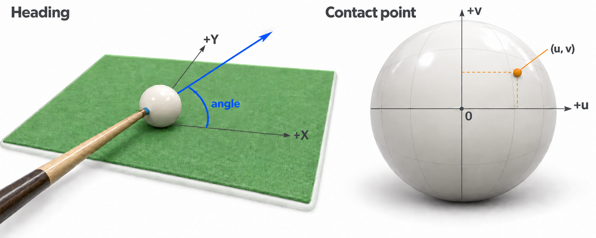

# Snooker MuJoCo 项目

[project under construction]

本仓库提供 Snooker 对局环境。在线文档：[简体中文](https://snooker.readthedocs.io/en/latest/) · [English](https://snooker.readthedocs.io/en/latest/en/)

## 安装与运行

使用 Python 3.10 或更高版本。

```bash
conda create -n pool python=3.10
conda activate pool
python -m pip install -r requirements.txt
```

运行两名 player 的对局：

```bash
python scripts/tools/play_snooker_match.py \
  --player-0 'python scripts/tools/snooker_example_player.py' \
  --player-1 'python scripts/tools/snooker_example_player.py'
```

若需录像：

```bash
MUJOCO_GL=egl \
  python scripts/tools/play_snooker_match.py \
    --player-0 'python scripts/tools/snooker_example_player.py' \
    --player-1 'python scripts/tools/snooker_example_player.py' \
    --record outputs/my_match \
    --fps 20
```

每个决策回合都会启动新的 player 进程：

1. 裁判将当前状态以一行 JSON 写入选手的标准输入。
2. 选手读取状态，输出击球动作。
3. 环境执行这一杆，更新状态，再调用接下来应击球的 player。

可加 `--max-shots 2` 完成 2 杆后停止运行，适合快速诊断。实际击球使用较小的物理时间步，完整对局可能耗时较长。

选手从标准输入读取一行 JSON 状态，向标准输出提交 `[angle, speed, u, v]`。`u,v` 是以母球半径归一化的直角坐标，满足 `u²+v²<1`；向右、向上为正。也可输出 `[angle, speed]`，默认击打正中间。日志写入 `stderr`。

<p align="center">
  
</p>

## 渲染 Snooker 场景

```bash
MUJOCO_GL=egl python scripts/render/render_snooker_diagnostics.py --images-only
```

诊断渲染展示球台环境。

## 目录说明


| 目录                 | 内容                                |
| ------------------ | --------------------------------- |
| `src/snooker_env/` | Snooker 状态、规则、player 协议、物理执行及共享依赖 |
| `models/`          | Snooker 球台、球与球杆模型                 |
| `assets/`          | 球杆视觉资源、许可说明及球台来源说明                |
| `scripts/tools/`   | 对局启动、选手示例、物理诊断与校准                 |
| `scripts/render/`  | 渲染脚本                              |
| `scripts/assets/`  | 程序化球台与球模型生成                       |


入口是 `SnookerMatchEnv`。